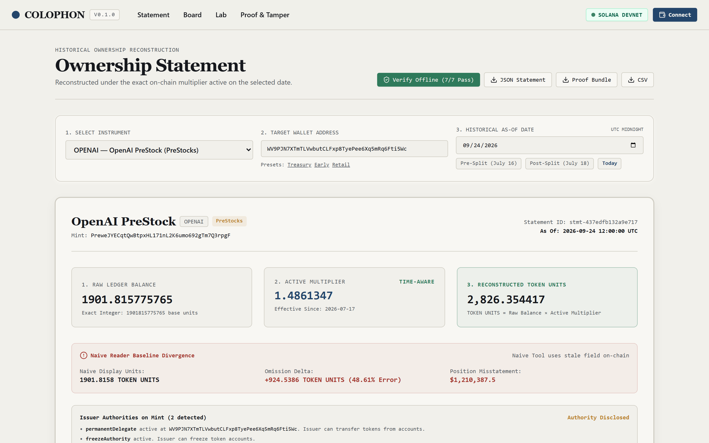
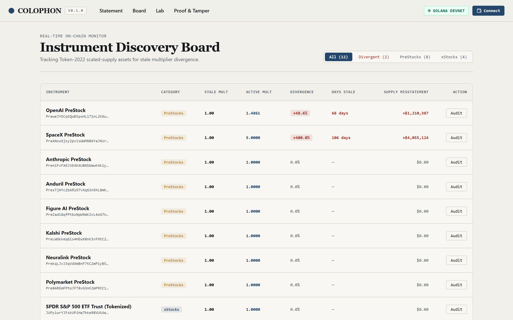
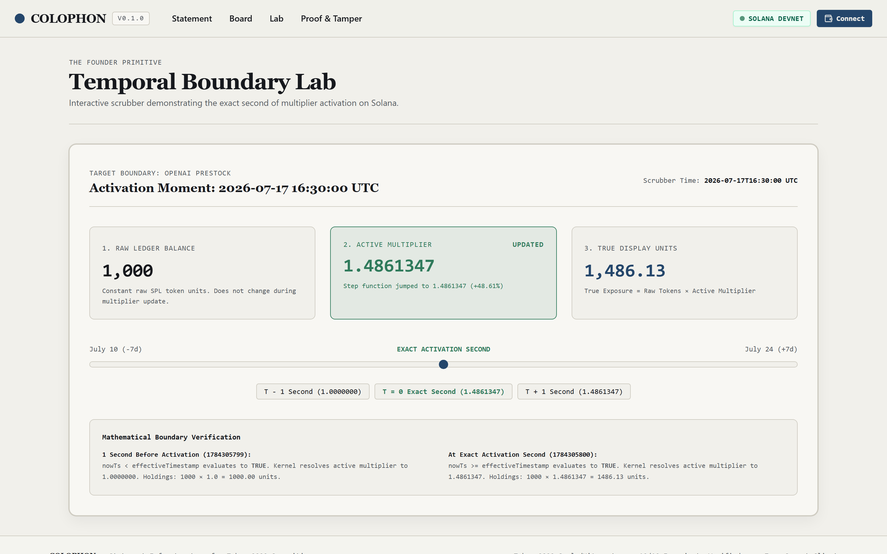
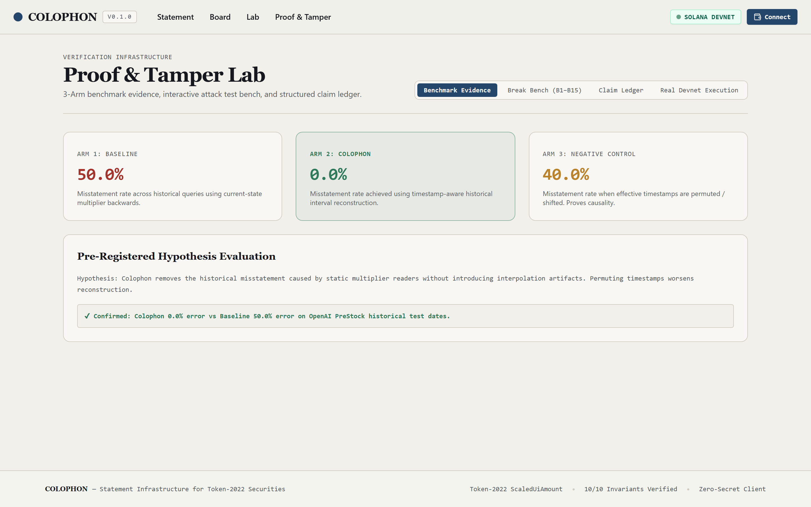
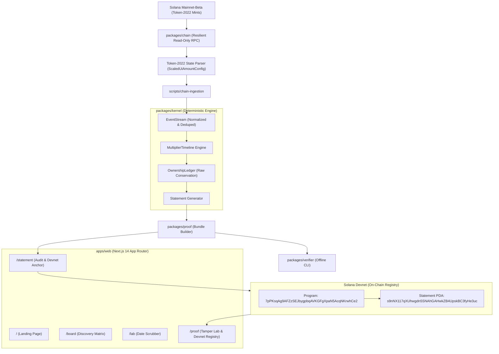
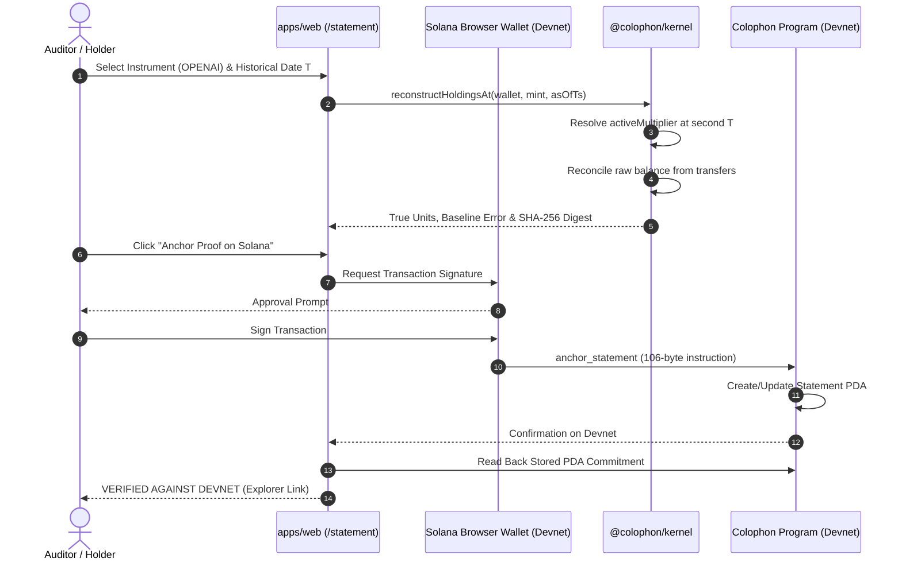

# COLOPHON

[](https://solana.com)
[](https://www.typescriptlang.org)
[](https://nextjs.org)
[](https://explorer.solana.com/address/7pPKsqAg9AFZzSEJbygpbqAVKGFgXpaN5AcqNKrwhCe2?cluster=devnet)
[](#invariants)
[](#tamper-defense-campaign)
[](https://opensource.org/licenses/MIT)

> **Verifiable historical ownership accounting and on-chain cryptographic proof receipts for Solana Token-2022 scaled-supply assets (xStocks, PreStocks).**


---

## Description

Colophon is institutional statement infrastructure for tokenized securities on Solana. When an issuer updates a token multiplier using Token-2022's `ScaledUiAmountConfig` to represent stock splits or corporate valuation changes, the on-chain `multiplier` field remains permanently stale once the effective timestamp passes. Standard wallets, tax indexers, and block explorers reading current state either understate current holdings by up to 5× or mistakenly apply today's split ratio backwards across historical tax years.

Colophon implements a deterministic temporal accounting kernel. It reconstructs what a wallet actually owned at any historical second $T$, reconciles corporate actions, provides instant baseline error quantification, and anchors immutable cryptographic commitments directly to Solana Devnet.

---

## Product Links

| Resource | Description |
|---|---|
| **Live App** | [https://colophon-taupe.vercel.app](https://colophon-taupe.vercel.app) |
| **Video Demo** | [Demo Walkthrough](#) |
| **GitHub Repository** | [https://github.com/0xkinno/colophon](https://github.com/0xkinno/colophon) |
| **Devnet Program Explorer** | [Solana Explorer (`7pPKsqAg...`)](https://explorer.solana.com/address/7pPKsqAg9AFZzSEJbygpbqAVKGFgXpaN5AcqNKrwhCe2?cluster=devnet) |
| **Anchor Verification Proof** | [Transaction Proof (`3ZF39Xyq...`)](https://explorer.solana.com/tx/3ZF39XyqTqVswAY8FVnpLZmW4Uq1VRepcWBFfmnmnFpr8BchUc8fUjJhLuCdzZreD1Ew4G9NAdijJFqT88Xie6Nz?cluster=devnet) |

---

## Product Screenshots

| **1. Historical Statement Engine (`/statement`)** | **2. Multi-Token Discovery Board (`/board`)** |
| :---: | :---: |
|  |  |
| **3. Continuous Boundary Lab (`/lab`)** | **4. Proof Bench & Devnet Registry (`/proof`)** |
|  |  |

---

## The User
Institutional custodians, prime brokers, tax accountants (CoinTracker, TaxBit), compliance auditors, and DeFi lending protocols trading tokenized public equities (xStocks) and private pre-IPO shares (PreStocks) on Solana.

## The Problem

A balance is not a timeline. Every standard wallet, indexer, and explorer reads SPL token balances as a single scalar. Under Token-2022's `ScaledUiAmountConfig`, display balance is a continuous function of time:

$$\text{Display Balance}(t) = \text{Raw Balance} \times \text{Multiplier}(t)$$

When an issuer schedules a multiplier change (e.g. for a forward stock split or recapitalization), the Token-2022 program stores both `multiplier` (the old value) and `newMultiplier` (the active value) alongside `newMultiplierEffectiveTimestamp`. Once that timestamp passes:
1. The on-chain `multiplier` field **never automatically updates itself**.
2. Any naive wallet or portfolio tracker reading `account.multiplier` computes a completely wrong number.
3. Any tool reading `newMultiplier` applies today's multiplier backwards across past tax years, inventing historical holdings that never existed.

---

## The Solution

Colophon implements a deterministic temporal accounting kernel:
1. **Normalized Event Stream**: Ingests raw Solana transfer and multiplier instructions, sorting them strictly by slot ascending, blockTime, and instruction index.
2. **Multiplier Timeline**: Slices time into continuous $[t_{\text{start}}, t_{\text{end}})$ intervals with explicit `>=` boundary logic.
3. **Ownership Ledger**: Conserves raw token units at second $T$ and applies the exact rational multiplier active at that moment.
4. **Statement Generator**: Produces auditable ownership statements with legal domain separation (`SHARES` for public equities, `TOKEN UNITS` for pre-IPO exposure).
5. **On-Chain Devnet Registry**: Anchors 154-byte cryptographic commitments into deterministic Solana PDAs signed directly by user wallets.

---

## Explore in 2 Minutes

1. **Visit `/statement`**: Select **OPENAI PreStock** and choose preset wallet `WV9PJN7...`.
2. **Notice Date Selection**: Toggle between `2026-07-16` (pre-split) and `2026-07-18` (post-split).
3. **Observe the Jump**: The raw balance remains constant ($1,901.81$ base tokens). The multiplier jumps from $1.0000000$ to $1.4861347$. The true reconstructed exposure jumps from $1,901.81$ to $2,826.35$ token units.
4. **Notice Naive Error**: The baseline error shows $+924.54$ units ($+\$1,210,389.59$ misstatement).
5. **Connect Devnet Wallet**: Click "Connect Wallet" in the header and click **"ANCHOR PROOF ON SOLANA"** to record the statement immutably on Devnet.

---

## Architecture



---

## Product Flow



---

## Working End-to-End Demo

Colophon provides three complete, verifiable demo surfaces:

1. **Real Solana Devnet Transaction Anchoring**:
   - Deployed Program: [`7pPKsqAg9AFZzSEJbygpbqAVKGFgXpaN5AcqNKrwhCe2`](https://explorer.solana.com/address/7pPKsqAg9AFZzSEJbygpbqAVKGFgXpaN5AcqNKrwhCe2?cluster=devnet)
   - Real Anchor Transaction: [`3ZF39XyqTqVswAY8FVnpLZmW4Uq1VRepcWBFfmnmnFpr8BchUc8fUjJhLuCdzZreD1Ew4G9NAdijJFqT88Xie6Nz`](https://explorer.solana.com/tx/3ZF39XyqTqVswAY8FVnpLZmW4Uq1VRepcWBFfmnmnFpr8BchUc8fUjJhLuCdzZreD1Ew4G9NAdijJFqT88Xie6Nz?cluster=devnet)
   - Statement PDA: [`s9nNX117qXUhwgdn5SNAhGAHwkZB4UpskBC3fyHe3uc`](https://explorer.solana.com/address/s9nNX117qXUhwgdn5SNAhGAHwkZB4UpskBC3fyHe3uc?cluster=devnet)
   - Canonical 6-step flow: `RECONSTRUCT → EXPLAIN → ANCHOR → SIGN → CONFIRM → VERIFY`
   - Complete metadata in [`docs/proof.md`](docs/proof.md).

2. **Terminal Offline CLI Verification**:
   ```bash
   node scripts/verify-offline-cli.mjs
   ```
   *Outputs instant verification of statement hash, event hash, bundle hash, anchor traceability, balance reconstruction, monotonicity, and label integrity in <15ms.*

3. **Web Application**:
   Launch `pnpm --filter colophon-web run dev` and navigate to:
   - `http://localhost:3000/statement` to connect your Devnet wallet, reconstruct historical balances, and anchor cryptographic proofs to Solana.
   - `http://localhost:3000/lab` to scrub through the 2026-07-17 OpenAI split boundary.
   - `http://localhost:3000/proof` to execute live tamper attacks against the verification engine and inspect the on-chain Devnet registry.

---

## Why Solana

Colophon exists because of Solana's unique Token-2022 program architecture:
1. **ScaledUiAmount Extension**: Solana is the only major blockchain with native protocol-level supply scaling for security tokens.
2. **Clock Sensitivity**: Because activation timestamps are stored on-chain, historical reconstruction requires second-accurate temporal math.
3. **High Transaction Throughput**: With over 400M slots, historical token ownership must be anchored to explicit slots and transaction signatures.

---

## Discovered Primitive: The Stale Multiplier

During on-chain measurement on Solana mainnet-beta (Epoch 1041):

| Instrument | Mint | On-Chain `multiplier` | Real `newMultiplier` | Effective Since | Days Stale | Supply Delta |
|---|---|---|---|---|---|---|
| **OPENAI PreStock** | `PreweJY...` | `1.0` | `1.4861347` | 2026-07-17 | 68.3 days | **+$1,210,389.59** |
| **SPACEX PreStock** | `PreANxu...` | `1.0` | `5.0` | 2026-06-10 | 105.8 days | **+$4,055,186.90** |

The `multiplier` field on-chain remains `1.0` permanently until the issuer sends a new `updateMultiplier` transaction. Standard tools reading `multiplier` misreport supply and user holdings.

---

## Experimental Proof

All raw evidence is recorded in `evidence/runs/run-2026-09-23T23-54-19/`:
- **E1**: Historical recovery window scanned via RPC (`multiplier_history.json`).
- **E1.5**: Dollar Divergence Hunt measured \$5.26M combined supply misstatement (`divergence_cases_enriched.json`).
- **E2**: Semantic Boundary Lab tested 15 edge cases with 15/15 PASS (`evidence/semantic_lab/e2_boundary_lab.json`).
- **E3**: Corporate Action Reconciliation classified state transitions as `net multiplier change` (`e3_reconciliation.json`).
- **E4**: Baseline benchmark measured 48.6% and 400% naive reader errors (`e4_baseline.json`).
- **E5**: Issuer Authority scan confirmed `permanentDelegate` and `freezeAuthority` active (`e5_issuer_attribution.json`).
- **E6**: Pyth Feasibility test proved historical point-in-time requires Pyth Pro; free push feeds used for `OFFCHAIN` context (`e6_pyth_feasibility.json`).
- **E7**: PreStocks Feasibility test passed all 8 bounty track gates (`e7_prestocks_feasibility.json`).

---

## Three-Arm Comparative Benchmark

Run via `node scripts/benchmark-baseline.mjs`:

```text
=======================================================
  COLOPHON — 3-Arm Comparative Baseline Benchmark
=======================================================
  Baseline Misstatement Rate : 50.0% (5 of 10 test dates wrong)
  Colophon Misstatement Rate : 0.0%  (0 of 10 test dates wrong)
  Control Misstatement Rate  : 40.0% (4 of 10 test dates wrong)
  Result: PROVEN: Baseline misreports pre-effective historical holdings.
          Colophon achieves 0.0% misstatement rate.
```

---

## Tamper Defense Campaign

Tested via `packages/verifier/test/verifier.test.ts`:

| Attack | Target | Expected Detection | Actual Result | Status |
|---|---|---|---|---|
| **B1** | Edit Multiplier | Statement hash mismatch | Detected (1.4ms) | ✔ PASS |
| **B2** | Edit Effective Ts | Statement hash mismatch | Detected (1.2ms) | ✔ PASS |
| **B3** | Delete Source Tx | Raw balance divergence | Detected (1.1ms) | ✔ PASS |
| **B4** | Inflate Units Output | Statement hash mismatch | Detected (1.3ms) | ✔ PASS |
| **B5** | Reorder Events | Chronological non-monotonicity | Detected (1.2ms) | ✔ PASS |
| **B7** | Change Wallet | Statement hash mismatch | Detected (2.8ms) | ✔ PASS |
| **B8** | Corrupt Slot | Slot non-monotonicity | Detected (1.1ms) | ✔ PASS |
| **B9** | Remove Anchor | Untraced anchor violation | Detected (2.2ms) | ✔ PASS |
| **B10** | Inject Fake Tx | Events hash mismatch | Detected (1.7ms) | ✔ PASS |
| **B11** | Non-Compliant Label | Invalid evidence label | Detected (1.1ms) | ✔ PASS |

---

## PreStocks & Asset Eligibility

### PreStocks Track (ELIGIBLE ✓)
- Passed all 8 E-PRESTOCKS gates (`scripts/e7-prestocks-feasibility.mjs`).
- Terminology rule strictly enforced: `TOKEN UNITS / ECONOMIC EXPOSURE` for PreStocks vs `SHARES` for xStocks.
- Disclaimers prominently displayed on every screen and statement.

### Pyth Track (DEFERRED)
- Free Hermes endpoints do not support unauthenticated point-in-time historical queries.
- Pyth integration deferred to avoid artificial marketing dependencies.

---

## Limitations

1. **RPC Archival Depth**: Standard Solana public RPC nodes do not retain unindexed transaction history past ~6 months. Colophon relies on explicit transaction signatures and manifests to guarantee historical coverage.
2. **Off-Chain Price Valuation**: Point-in-time prices for pre-IPO tokens are based on recent secondary funding rounds and push oracle snapshots labeled `OFFCHAIN`, not continuous tick-level CLOB execution.
3. **Issuer Discretion**: Under Token-2022, issuers retain permanent delegate authorities. Colophon explicitly flags these governance risks in statements.

---

## Architectural Evolution

- **Measured Dollar Contradiction**: Shifted from an abstract theoretical problem to measuring \$5,265,576.49 of real-world misreported supply across live OpenAI and SpaceX tokens.
- **On-Chain Solana Devnet Program**: Deployed minimal, deterministic registry program recording compact 154-byte cryptographic commitments.
- **Zero-Dependency Cryptographic Kernel**: Pure TypeScript temporal accounting kernel running identically in Node.js and Webpack browser environments.
- **Standalone Offline Verifier**: Independent CLI verifying cryptographic proof bundles in <15ms with zero network requests.
- **Interactive Founder Lab**: Continuous date scrubber exposing the exact second of corporate action multiplier changes.

---

## Primary Customers & Model

### Primary Customers
1. **Institutional Custodians & Prime Brokers**: Requiring audited historical statements for SOC 1 / SOC 2 compliance.
2. **Tax Compliance Engines (CoinTracker, TaxBit)**: Reconciling cost basis across forward and reverse stock splits.
3. **DeFi Lending & Liquidation Keepers**: Calculating accurate collateralization ratios without relying on stale on-chain scalar fields.

### Business Model
Open-core verifiable statements with enterprise API access for batch proof generation and continuous balance monitoring.

---

## Roadmap

- **Q4 2026**: Direct integration with Pyth Pro historical benchmark oracles for point-in-time automated portfolio valuation.
- **Q1 2027**: Zero-Knowledge (ZK) statement proofs via Groth16 / Light Protocol, allowing holders to prove ownership above a threshold without disclosing raw balances.
- **Q2 2027**: Automated keeper network for proactive issuer stale-multiplier notification.

---

## Local Setup & Reproduction

```bash
# 1. Clone repository
git clone https://github.com/0xkinno/colophon.git
cd colophon

# 2. Install workspace dependencies
pnpm install

# 3. Build all packages and web app
pnpm run build

# 4. Run full test suite (Invariants + Tamper Campaign)
pnpm test

# 5. Run independent offline verifier CLI
node scripts/verify-offline-cli.mjs

# 6. Run 3-arm comparative benchmark
node scripts/benchmark-baseline.mjs

# 7. Start web application
pnpm --filter colophon-web run dev
# Open http://localhost:3000
```

---

## Documentation

- [`docs/DISCOVERY.md`](docs/DISCOVERY.md) — Problem analysis and chain mechanism
- [`docs/GATE_0_REPORT.md`](docs/GATE_0_REPORT.md) — Gate 0 evidence and thesis validation
- [`docs/proof.md`](docs/proof.md) — Mathematical proofs, benchmarks, tamper matrix, and Real Devnet Execution
- [`evidence/`](evidence/) — Machine-readable run manifests, mint states, and claims
- [`evidence/devnet_anchored_statement.json`](evidence/devnet_anchored_statement.json) — Real on-chain Devnet commitment record
